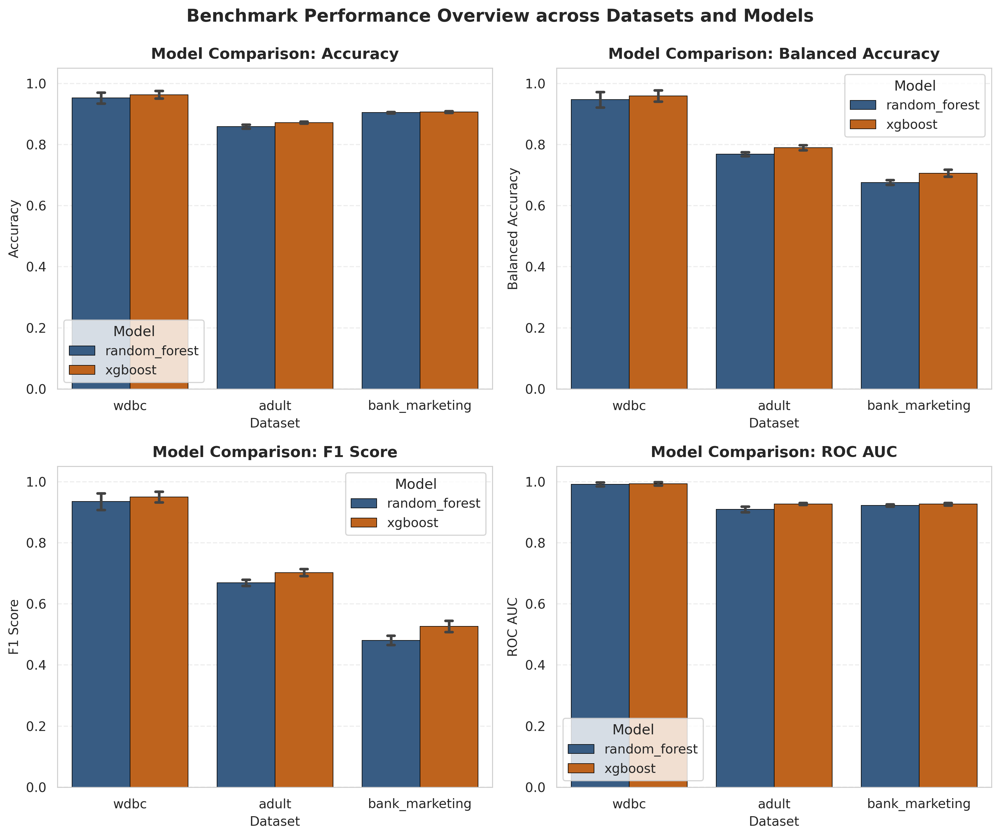

<div align="center">

# 🔬 Fair HPO Tabular Benchmark

### An Empirical Audit of Performance, Fairness, and Compute Cost  
### in Tabular Hyperparameter Optimization

[](https://www.python.org/)
[](LICENSE)
[](tests/)
[](results/)
[](docs/manuscript_draft.pdf)
[](https://github.com/Moazzam9/fair-hpo-tabular-benchmark)

**Author:** Moazzam Azam &nbsp;|&nbsp; Independent Researcher &nbsp;|&nbsp; moazzamkk13@gmail.com

</div>

---

## 📌 Table of Contents

- [Overview](#-overview)
- [Key Findings](#-key-findings)
- [Results at a Glance](#-results-at-a-glance)
- [Project Architecture](#-project-architecture)
- [Repository Structure](#-repository-structure)
- [Datasets](#-datasets)
- [Experimental Design](#-experimental-design)
- [Installation & Quickstart](#-installation--quickstart)
- [Running the Benchmark](#-running-the-benchmark)
- [Running Tests](#-running-tests)
- [Paper & Manuscript](#-paper--manuscript)
- [Results & Figures](#-results--figures)
- [Limitations & Future Work](#-limitations--future-work)
- [Citation](#-citation)

---

## 🧭 Overview

This repository presents a **rigorous, reproducible, multi-dimensional empirical audit** of conventional hyperparameter optimization (HPO) strategies applied to tabular classification tasks.

Standard HPO benchmarks focus exclusively on predictive performance. This audit goes further by simultaneously evaluating:

| Dimension | Metrics |
|---|---|
| 🎯 **Predictive Performance** | Accuracy, Balanced Accuracy, F1-Score, ROC AUC |
| ⚖️ **Group Fairness** | Demographic Parity Difference (DPD), Equal Opportunity Difference (EOD) |
| ⏱️ **Computational Cost** | Runtime (seconds), outlier detection, distribution analysis |
| 📊 **Statistical Rigor** | Paired Wilcoxon signed-rank tests, Cohen's *d*_z effect sizes |

The benchmark compares two widely-used models — **Random Forest** and **XGBoost** — optimized using **Random Search** and **Bayesian Optimization** under a strict nested cross-validation framework across **three real-world tabular datasets**.

---

## 🔑 Key Findings

> **60 experiments** · **3 datasets** · **2 models** · **2 optimizers** · **5-fold nested CV**

### 1. XGBoost Significantly Outperforms Random Forest
XGBoost achieves higher scores across all predictive metrics with large, statistically significant effect sizes:

| Metric | Random Forest | XGBoost | Δ | *p*-value | Cohen's *d*_z |
|---|---|---|---|---|---|
| Accuracy | 0.9054 | 0.9138 | +0.0084 | < 0.001 | 0.77 (Medium) |
| Balanced Accuracy | 0.7973 | 0.8186 | +0.0214 | < 0.001 | 1.41 (Large) |
| F1-Score | 0.6949 | 0.7263 | +0.0314 | < 0.001 | 1.48 (Large) |
| ROC AUC | 0.9411 | 0.9491 | +0.0080 | < 0.001 | 0.91 (Large) |

### 2. Bayesian HPO Offers Only Marginal Gains Over Random Search
The performance improvement from Bayesian optimization is real but small in practical terms:

| Metric | Random Search | Bayesian HPO | Δ | *p*-value | Cohen's *d*_z |
|---|---|---|---|---|---|
| Accuracy | 0.9088 | 0.9103 | +0.0015 | 0.032 | 0.26 (Small) |
| Balanced Accuracy | 0.8061 | 0.8098 | +0.0038 | 0.045 | 0.40 (Small) |
| F1-Score | 0.7073 | 0.7139 | +0.0066 | 0.007 | 0.54 (Medium) |
| ROC AUC | 0.9436 | 0.9465 | +0.0030 | 0.020 | 0.46 (Small) |

### 3. Fairness Disparities Persist Regardless of HPO Choice
On the Adult dataset (sensitive attribute: `sex`), both models exhibit measurable group bias that is **not resolved by optimizer choice**:

| Configuration | DPD (Mean ± SD) | EOD (Mean ± SD) |
|---|---|---|
| RF + Random Search | 0.1767 ± 0.0055 | 0.0830 ± 0.0492 |
| RF + Bayesian | 0.1600 ± 0.0073 | 0.0857 ± 0.0434 |
| XGBoost + Random Search | 0.1672 ± 0.0069 | 0.0783 ± 0.0333 |
| XGBoost + Bayesian | 0.1729 ± 0.0046 | 0.0703 ± 0.0339 |

Optimizer impact on DPD: *p* = 0.23 · Model impact on DPD: *p* = 0.49 — **no statistically significant effect**.

### 4. Runtime Anomaly Identified and Investigated
A single fold (Adult / XGBoost / Bayesian / Fold 5) ran for **51,992 seconds (~14.44 hours)** — a **140× exceedance** of the group median. Post-hoc inspection confirmed the selected hyperparameters and test metrics were completely normal, classifying this as a **system-level execution artifact** (OS contention / memory swap) rather than an algorithmic issue.

---

## 📊 Results at a Glance

<div align="center">

### Predictive Performance


### Fairness Metrics (Adult Dataset)


### Runtime Distributions


</div>

---

## 🏗️ Project Architecture

```
fair_hpo/                   ← Core Python package (src/fair_hpo/)
├── config/                 ← Configuration loaders (YAML)
├── data/                   ← Dataset loading and management
├── preprocessing/          ← Feature engineering and normalization
├── models/                 ← Random Forest and XGBoost wrappers
├── optimizers/             ← Random Search and Bayesian HPO
├── experiments/            ← Nested CV experiment orchestration
├── evaluation/             ← Metrics: predictive + fairness
├── statistics/             ← Wilcoxon tests, effect sizes
└── reporting/              ← CSV and figure generation

scripts/                    ← Executable entry points
├── run_full_benchmark.py   ← Main benchmark runner
├── generate_statistical_analysis.py  ← Stats + effect sizes
├── generate_publication_analysis.py  ← Figures + publication tables
└── download_datasets.py    ← UCI dataset downloader

configs/                    ← Experiment configuration files
├── datasets.yaml           ← Dataset registry
└── fairness.yaml           ← Sensitive attribute definitions

results/publication/        ← Final outputs
├── fold_level_results.csv           ← All 60 fold results
├── summary_by_dataset_model_optimizer.csv
├── statistical_tests.csv            ← Wilcoxon p-values + Cohen's d_z
├── fairness_analysis.csv            ← Fairness metrics
├── runtime_analysis.csv             ← Runtime statistics
├── anomaly_analysis.csv             ← Outlier detection
└── figures/                         ← Publication-ready PNG figures

docs/                       ← Manuscript
├── manuscript_draft.md     ← Paper (Markdown)
├── manuscript_draft.tex    ← Paper (LaTeX)
├── manuscript.bib          ← BibTeX bibliography
└── figures/                ← Figures bundled with LaTeX source
```

---

## 📁 Repository Structure

```
fair-hpo-tabular-benchmark/
├── src/                    ← Python package source
├── scripts/                ← Runnable scripts
├── configs/                ← YAML configuration files
├── data/                   ← Downloaded datasets (gitignored)
├── results/                ← All benchmark outputs and figures
├── docs/                   ← Manuscript (Markdown + LaTeX)
├── tests/                  ← Unit and integration tests (14 tests)
├── logs/                   ← Execution logs
├── requirements.txt        ← Python dependencies
├── FINAL_AUDIT.md          ← Final audit summary
├── LICENSE                 ← MIT License
└── README.md
```

---

## 📚 Datasets

All datasets are sourced from the **[UCI Machine Learning Repository](https://archive.ics.uci.edu/)** and downloaded automatically via `ucimlrepo`.

| Dataset | Instances | Features | Type | Task | Sensitive Attribute | DOI |
|---|---|---|---|---|---|---|
| **Breast Cancer Wisconsin (WDBC)** | 569 | 30 | Real-valued | Binary (Malignant / Benign) | None configured | [10.24432/C5DW2B](https://doi.org/10.24432/C5DW2B) |
| **Adult (Census Income)** | 48,842 | 14 | Mixed | Binary (>50K / ≤50K) | `sex` (Male / Female) | [10.24432/C5XW20](https://doi.org/10.24432/C5XW20) |
| **Bank Marketing** | 45,211 | 16 | Mixed | Binary (Subscribed / Not) | None configured | [10.24432/C5K306](https://doi.org/10.24432/C5K306) |

> **Note on Fairness Scope:** WDBC and Bank Marketing show `0.0` for fairness metrics. This reflects the **absence of a configured sensitive attribute**, not evidence of bias absence. Fairness analysis is only meaningful on the Adult dataset.

---

## 🧪 Experimental Design

### Protocol
| Parameter | Setting |
|---|---|
| Outer CV folds | 5 |
| Inner CV folds | 3 |
| HPO budget | 20 iterations per fold |
| Inner objective | Balanced Accuracy |
| Random seeds | Fixed (reproducible) |
| HPO frameworks | `scikit-learn` (RandomizedSearchCV), `scikit-optimize` (BayesSearchCV) |

### Nested Cross-Validation

```
Outer Fold k (1–5)
└── Inner Search (3-fold CV, 20 iterations)
    └── Best hyperparameters selected
└── Final model trained on full outer train set
└── Evaluated on held-out outer test set
    ├── Predictive metrics (Accuracy, BA, F1, AUC)
    ├── Fairness metrics (DPD, EOD) [Adult only]
    └── Runtime (seconds)
```

This design separates hyperparameter selection from generalization evaluation, preventing optimistic bias in reported metrics.

### Search Spaces

**Random Forest:**
- `n_estimators`: {50, 100, 200}
- `max_depth`: {None, 5, 10, 20}
- `min_samples_split`: {2, 5, 10}
- `min_samples_leaf`: {1, 2, 4}
- `max_features`: {`sqrt`, `log2`}

**XGBoost:**
- `n_estimators`: Integer(50, 200)
- `max_depth`: Integer(3, 10)
- `learning_rate`: Real(0.01, 0.3, prior=`log-uniform`)
- `subsample`: Real(0.6, 1.0)
- `colsample_bytree`: Real(0.6, 1.0)
- `min_child_weight`: Integer(1, 10)

---

## ⚙️ Installation & Quickstart

### Prerequisites

- Python 3.10 or higher
- pip

### 1. Clone the repository

```bash
git clone https://github.com/Moazzam9/fair-hpo-tabular-benchmark.git
cd fair-hpo-tabular-benchmark
```

### 2. Create and activate a virtual environment

```bash
# Windows
python -m venv .venv
.venv\Scripts\activate

# Linux / macOS
python -m venv .venv
source .venv/bin/activate
```

### 3. Install dependencies

```bash
pip install -r requirements.txt
pip install -e .
```

### 4. Download datasets

```bash
python scripts/download_datasets.py
```

---

## 🚀 Running the Benchmark

### Full Benchmark (all 60 experiments)

```bash
python scripts/run_full_benchmark.py
```

> ⚠️ This runs 60 nested CV experiments. Expected runtime: several hours depending on hardware.

### Statistical Analysis

```bash
python scripts/generate_statistical_analysis.py
```

Outputs Wilcoxon p-values and Cohen's *d*_z effect sizes to `results/publication/`.

### Publication Figures & Tables

```bash
python scripts/generate_publication_analysis.py
```

Outputs all figures and summary tables to `results/publication/figures/`.

---

## 🧪 Running Tests

The test suite covers configuration, data loading, preprocessing, models, optimizers, metrics, and the full nested CV pipeline.

```bash
python -m pytest -v
```

**Current status: ✅ 14/14 tests passing**

```
tests/test_config.py         ✓
tests/test_fairness_data.py  ✓
tests/test_hpo.py            ✓
tests/test_metrics.py        ✓
tests/test_models.py         ✓
tests/test_nested_cv.py      ✓
tests/test_optimizers.py     ✓
tests/test_preprocessing.py  ✓
tests/test_runner.py         ✓
```

---

## 📄 Paper & Manuscript

The full research paper is available in the `docs/` folder in both Markdown and LaTeX formats.

| Format | File | Description |
|---|---|---|
| 📝 Markdown | [`docs/manuscript_draft.md`](docs/manuscript_draft.md) | Human-readable version |
| 📐 LaTeX | [`docs/manuscript_draft.tex`](docs/manuscript_draft.tex) | For PDF compilation |
| 📚 BibTeX | [`docs/manuscript.bib`](docs/manuscript.bib) | All 8 references |
| 🖼️ Figures | [`docs/figures/`](docs/figures/) | PNG figures bundled with LaTeX |

### Compile to PDF (Overleaf — Recommended)

1. Go to [overleaf.com](https://www.overleaf.com) → **New Project → Upload Project**
2. Upload all files from `docs/`: `manuscript_draft.tex`, `manuscript.bib`, and the `figures/` folder
3. Click **Compile** → download the PDF

### Compile to PDF (Local — requires TeX Live or MiKTeX)

```bash
cd docs
pdflatex manuscript_draft.tex
bibtex manuscript_draft
pdflatex manuscript_draft.tex
pdflatex manuscript_draft.tex
```

---

## 📈 Results & Figures

All benchmark outputs are stored under `results/publication/`:

| File | Contents |
|---|---|
| `fold_level_results.csv` | All 60 fold-level experiment results |
| `summary_by_dataset_model_optimizer.csv` | Group-level means and standard deviations |
| `statistical_tests.csv` | Wilcoxon p-values and Cohen's *d*_z |
| `fairness_analysis.csv` | DPD and EOD metrics (Adult dataset) |
| `runtime_analysis.csv` | Runtime summary statistics |
| `anomaly_analysis.csv` | IQR-based outlier detection results |
| `model_comparison.csv` | RF vs. XGBoost direct comparison |
| `optimizer_comparison.csv` | Random Search vs. Bayesian comparison |
| `figures/` | High-resolution PNG figures |

---

## ⚠️ Limitations & Future Work

### Current Limitations

- **Convergence histories** were not persisted during the main benchmark run due to a logging omission in the driver script (since corrected). Pilot histories exist only for 2 preliminary Adult configurations.
- **Multiple comparisons**: All p-values are exploratory and uncorrected. Results should be interpreted as directional evidence rather than confirmatory.
- **Small fairness sample**: Fairness comparisons use *n* = 10 paired configurations, which limits statistical power.
- **System artifact**: The 14.44-hour runtime outlier on Adult/XGBoost/Bayesian/Fold-5 is classified as a system-level execution artifact and is **excluded from efficiency conclusions**.

### Planned Extensions

- [ ] **Metaheuristic optimizers**: Genetic Algorithm (GA), Particle Swarm Optimization (PSO), Differential Evolution (DE)
- [ ] **Fairness-constrained HPO**: Multi-objective optimization balancing performance and group fairness simultaneously
- [ ] **Full convergence trajectory logging**: Per-iteration history for all future runs
- [ ] **Additional datasets**: Extend the benchmark to more domains with sensitive attributes
- [ ] **Additional models**: LightGBM, CatBoost, MLP

---

## 📖 Citation

If this work is useful to your research, please cite:

**APA:**
> Azam, M. (2026). *An Empirical Audit of Performance, Fairness, and Compute Cost in Tabular Hyperparameter Optimization*. Zenodo. https://doi.org/10.5281/zenodo.22090994

**BibTeX:**
```bibtex
@misc{azam2026hpofair,
  author    = {Moazzam Azam},
  title     = {An Empirical Audit of Performance, Fairness, and Compute Cost
               in Tabular Hyperparameter Optimization},
  year      = {2026},
  publisher = {Zenodo},
  doi       = {10.5281/zenodo.22090994},
  url       = {https://doi.org/10.5281/zenodo.22090994}
}
```

---

## 📜 License

This project is licensed under the **MIT License**. See the [LICENSE](LICENSE) file for details.

---

<div align="center">

Made by **Moazzam Azam** · Independent Researcher · moazzamkk13@gmail.com

⭐ If this project helped you, consider starring the repository!

</div>