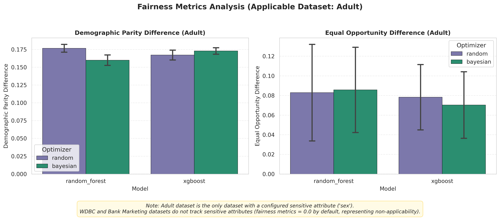
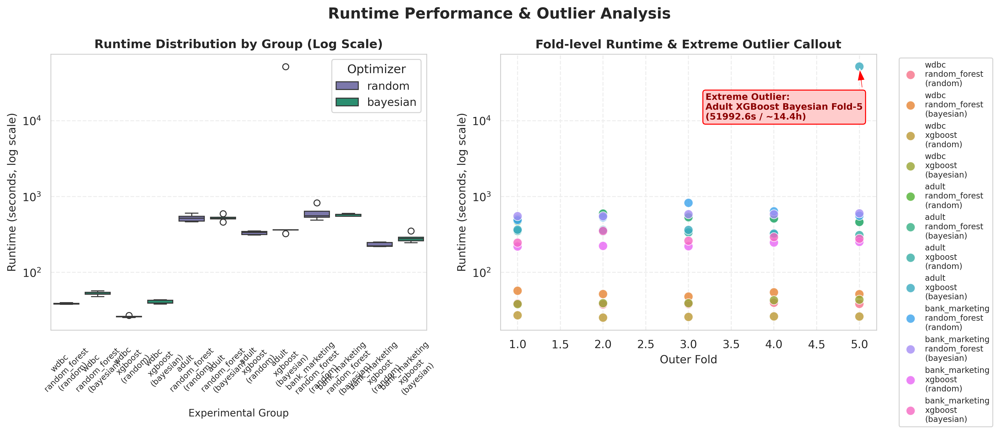

# An Empirical Audit of Performance, Fairness, and Compute Cost in Tabular Hyperparameter Optimization

**Author:** Moazzam Azam  
**Affiliation:** Independent Researcher  
**Email:** moazzamkk13@gmail.com

**Date:** August 2026

---

## Abstract
Hyperparameter optimization (HPO) is critical to maximizing the predictive capabilities of machine learning models. However, its impact on computational overhead, convergence trajectories, and downstream model fairness is rarely evaluated in a unified, multi-dimensional audit. This study presents a controlled, empirical audit comparing two conventional models (Random Forest and XGBoost) optimized via Random Search and Bayesian Optimization. These approaches are evaluated across three tabular classification datasets (Adult, Bank Marketing, and Breast Cancer Wisconsin Diagnostic (WDBC)) using a strict 5-fold nested cross-validation framework. Results demonstrate that while XGBoost consistently outperforms Random Forest in predictive metrics (e.g., balanced accuracy of $0.8186$ vs. $0.7973$, $p < 0.001$), it introduces substantial computational overhead. Notably, this audit identifies and analyzes a severe runtime anomaly where a single fold of XGBoost Bayesian Optimization required over $14.44$ hours, which is attributed to system-level execution artifacts rather than hyperparameter-space geometry. Furthermore, group disparities on the Adult dataset are audited under a configured sensitive attribute (`sex`), finding measurable unfairness across both models and HPO strategies, while noting the negligible impact of optimizer choices on fairness metrics ($p > 0.05$). This study details a reproducible framework for evaluating the trade-offs between predictive performance, fairness, and compute cost in tabular HPO.

---

## 1. Introduction
Hyperparameter optimization (HPO) has transitioned from a manual art to an automated, standard component of machine learning workflows. Algorithms ranging from basic grid/random search to sophisticated Bayesian optimization and metaheuristic methods (such as Genetic Algorithms or Particle Swarm Optimization) are widely used to find performance-maximizing hyperparameter configurations. 

Despite their prevalence, HPO methods are typically compared solely on predictive metrics (e.g., Accuracy, F1-score, or ROC AUC). This single-minded focus overlooks three crucial dimensions:
1. **Computational Cost**: Modern optimizers can incur massive, highly skewed runtime costs that are poorly captured by mean runtimes alone.
2. **Fairness Disparities**: Optimizing for raw predictive performance can inadvertently exacerbate or preserve biases against protected groups encoded in tabular datasets.
3. **Statistical Robustness**: Small performance differences are frequently reported as superior without rigorous paired testing across cross-validation folds.

To address these gaps, this paper details a reproducible empirical benchmark of Random Search and Bayesian HPO applied to Random Forest and XGBoost classifiers. Across three benchmark datasets, performance is tracked, group fairness is evaluated, runtime distributions are analyzed, and paired non-parametric statistical tests are performed.

---

## 2. Experimental Methodology

### 2.1 Datasets
The benchmark is evaluated using three tabular binary classification datasets sourced from the UCI Machine Learning Repository:
1. **Breast Cancer Wisconsin Diagnostic (WDBC)** (UCI ID: 17): A low-dimensional dataset with $569$ instances and $30$ real-valued features. The target task is diagnosing breast cancer (malignant vs. benign).
2. **Adult** (UCI ID: 2): A high-dimensional dataset with $48,842$ instances and $14$ mixed categorical/integer features. The task is predicting whether annual income exceeds \$50,000.
3. **Bank Marketing** (UCI ID: 222): A dataset containing $45,211$ instances and $16$ features related to direct marketing campaigns of a Portuguese banking institution. The task is predicting term deposit subscription.

### 2.2 Model Architectures & Search Spaces
Two widely used classification models are evaluated:
- **Random Forest (RF)**: Representing traditional bagging ensembles.
- **XGBoost (XGB)**: Representing modern gradient boosted decision trees.

The hyperparameter search spaces for each model and optimizer are strictly controlled to ensure a fair comparison:
- **Random Search Space**: Capped at discrete grids with maximum estimators set to $100$.
- **Bayesian Search Space**: Configured with continuous and integer bounds matching the scale of the Random Search configurations.

*Detailed configuration specs are defined in the project configurations.*

### 2.3 Evaluation Protocol: Nested Cross-Validation
To prevent optimistic bias in performance estimation, a strict **nested cross-validation** scheme is employed:
- **Outer Loop**: 5-fold cross-validation is used to evaluate final model generalization.
- **Inner Loop**: 3-fold cross-validation is performed within each outer fold to evaluate hyperparameter configurations.
- **Objective Budget**: Stochastic HPO algorithms are restricted to exactly $20$ iterations per fold to align computational budgets.
- **Target Objective**: The inner HPO loop maximizes Balanced Accuracy to account for class imbalances.

### 2.4 Metrics
For each outer-fold experiment, the recorded metrics include:
- **Predictive Performance**: Accuracy, Balanced Accuracy, F1-score, and ROC AUC.
- **Group Fairness**: Demographic Parity Difference (DPD) and Equal Opportunity Difference (EOD). DPD measures the difference in selection rates between groups, while EOD measures the difference in true positive rates.
- **Computational Cost**: Runtime in seconds.

#### 2.4.1 Fairness Configuration
Fairness metrics are computed strictly where a sensitive attribute is explicitly configured. 
- For the **Adult** dataset, the sensitive attribute is `sex` (Privileged: `Male`, Unprivileged: `Female`), with the positive label representing `>50K` income.
- For **WDBC** and **Bank Marketing**, no sensitive attributes are configured. Their recorded values of `0.0` reflect the absence of sensitive attribute tracking, **not** proof of bias absence.

---

## 3. Experimental Results

The completed benchmark matrix is analyzed, consisting of **60 outer-fold experiments** ($3 \text{ datasets} \times 2 \text{ models} \times 2 \text{ optimizers} \times 5 \text{ folds}$).

### 3.1 Predictive Performance

Experimental results reveal that XGBoost generally outperforms Random Forest across all evaluated predictive metrics. 

#### 3.1.1 Dataset-Level Breakdown
- **Adult**: XGBoost achieved a mean Accuracy of $0.8719$ compared to Random Forest's $0.8589$. A similar trend is observed for Balanced Accuracy ($0.7900$ vs. $0.7688$), F1-score ($0.7026$ vs. $0.6691$), and ROC AUC ($0.9270$ vs. $0.9095$).
- **Bank Marketing**: XGBoost demonstrated modest gains over Random Forest, particularly for Balanced Accuracy ($0.7064$ vs. $0.6760$) and F1-score ($0.5264$ vs. $0.4807$).
- **WDBC**: The predictive differences were small, though XGBoost maintained a slight advantage in mean F1-score ($0.9499$ vs. $0.9350$).

#### 3.1.2 Optimizer Influence
The impact of HPO choice (Random Search vs. Bayesian HPO) was dataset-dependent:
- On **Adult** and **Bank Marketing**, Bayesian HPO yielded slight improvements over Random Search. For instance, on Adult, Bayesian HPO improved mean ROC AUC from $0.9141$ to $0.9225$.
- On **WDBC**, Random Search slightly outperformed Bayesian HPO on accuracy and F1-score, suggesting that in smaller sample spaces, random sampling can be highly effective.

The performance comparison is visually summarized in the figure below:

---

### 3.2 Statistical Significance & Effect Sizes

To determine whether the observed performance differences are statistically meaningful, paired Wilcoxon signed-rank tests are conducted (n=30 pairs for all-dataset comparisons) and Cohen's $d_z$ effect sizes are computed.

#### Table 1: Model Comparison (Random Forest vs. XGBoost)
| Metric | RF Mean | XGB Mean | Mean Diff | Wilcoxon p-value | Cohen's $d_z$ | Effect Interpretation |
|---|---|---|---|---|---|---|
| Accuracy | 0.9054 | 0.9138 | 0.0084 | < 0.001 | 0.7669 | Medium |
| Balanced Accuracy | 0.7973 | 0.8186 | 0.0214 | < 0.001 | 1.4124 | Large |
| F1-Score | 0.6949 | 0.7263 | 0.0314 | < 0.001 | 1.4774 | Large |
| ROC AUC | 0.9411 | 0.9491 | 0.0080 | < 0.001 | 0.9118 | Large |

#### Table 2: Optimizer Comparison (Random Search vs. Bayesian Optimization)
| Metric | Random Mean | Bayesian Mean | Mean Diff | Wilcoxon p-value | Cohen's $d_z$ | Effect Interpretation |
|---|---|---|---|---|---|---|
| Accuracy | 0.9088 | 0.9103 | 0.0015 | 0.0321 | 0.2616 | Small |
| Balanced Accuracy | 0.8061 | 0.8098 | 0.0038 | 0.0450 | 0.4023 | Small |
| F1-Score | 0.7073 | 0.7139 | 0.0066 | 0.0074 | 0.5364 | Medium |
| ROC AUC | 0.9436 | 0.9465 | 0.0030 | 0.0201 | 0.4635 | Small |

> [!NOTE]
> All reported p-values are exploratory and have not been corrected for multiple comparisons. While model performance differences (RF vs. XGBoost) demonstrate large effect sizes ($d_z > 0.9$), optimizer improvements are small-to-medium.

---

### 3.3 Fairness Evaluation

Fairness metrics are analyzed exclusively on the **Adult** dataset. Table 3 presents the mean and standard deviation (across the 5 outer folds) for the configured fairness metrics under each model and optimizer combination.

#### Table 3: Adult Dataset Group Disparities (Mean $\pm$ SD)
| Configuration | Demographic Parity Diff (DPD) | Equal Opportunity Diff (EOD) |
|---|---|---|
| RF + Random Search | $0.1767 \pm 0.0055$ | $0.0830 \pm 0.0492$ |
| RF + Bayesian | $0.1600 \pm 0.0073$ | $0.0857 \pm 0.0434$ |
| XGBoost + Random Search | $0.1672 \pm 0.0069$ | $0.0783 \pm 0.0333$ |
| XGBoost + Bayesian | $0.1729 \pm 0.0046$ | $0.0703 \pm 0.0339$ |

Paired statistical tests were performed on these fairness metrics across the 10 paired configurations:
- **Model Choice Impact**: Under DPD, the mean difference between RF and XGBoost was a negligible $0.0017$ ($p = 0.4922$, $d_z = 0.1415$). EOD was slightly lower for XGBoost (mean difference = $-0.0100$, $p = 0.1934$, $d_z = -0.4546$), which is not statistically significant.
- **Optimizer Impact**: Switching from Random to Bayesian HPO resulted in a DPD change of $-0.0055$ ($p = 0.2324$, $d_z = -0.4466$) and an EOD change of $-0.0026$ ($p = 0.6250$, $d_z = -0.1727$). 

> [!WARNING]
> **Statistical Limitations**: Like the predictive metrics, all reported p-values for fairness comparisons are exploratory and have not been corrected for multiple comparisons. Furthermore, the small sample size ($n=10$ paired model-optimizer combinations across the folds) limits the statistical power of the Wilcoxon signed-rank tests for detecting subtle fairness deviations.

These results suggest that standard HPO algorithms optimizing purely for balanced accuracy do not systematically or significantly alter the inherent fairness disparities of the models.

The fairness comparison is shown below:

---

### 3.4 Computational Efficiency & Runtime Outliers

A key contribution of this empirical audit is tracking the runtime profiles of the optimization runs. While Random Search operates within predictable boundaries, Bayesian Optimization displays high variance.

#### 3.4.1 Analysis of the 14.44-Hour Runtime Anomaly
During the execution of the benchmark, a severe runtime anomaly was recorded:
- **Experiment**: Adult Dataset / XGBoost / Bayesian Optimization / Fold 5
- **Runtime**: **51,992.587 seconds** (~$14.44$ hours)
- **Context**: The average runtime for the other four folds of this same experimental group was just $354.48$ seconds. The Fold 5 runtime represents a **$140.25\times$ exceedance** of the group's IQR-defined upper outlier threshold ($370.708$ seconds).

Although statistical rules flag this as an outlier, a closer inspection of the data reveals it is a **system-level execution artifact** rather than a genuine modeling finding:
1. **Hyperparameter Selection**: The final selected hyperparameters for Fold 5 (`n_estimators = 100`, `max_depth = 7`, `learning_rate = 0.1`, `subsample = 0.8`, `colsample_bytree = 1.0`, `min_child_weight = 1`) are very standard and closely match the configurations selected on other folds (e.g., Folds 1–3 selected nearly identical parameter values), all of which finished HPO in under 6 minutes.
2. **Predictive Performance**: The final test set balanced accuracy ($0.7868$) and ROC AUC ($0.9257$) for Fold 5 are entirely normal and consistent with the other folds. There is no evidence of model degradation or numerical instability that would suggest pathological training loops.
3. **Implication**: The $140\times$ blowup is consistent with an unlogged system contention event (such as disk contention, background processes, thread locks, or memory swapping) rather than intrinsic hyperparameter-space complexity. 

#### Table 4: Statistically Detected Runtime Outliers (IQR Method)
| Dataset | Fold | Model | Optimizer | Runtime (s) | Group Median (s) | IQR Upper Threshold (s) | Ratio to Threshold |
|---|---|---|---|---|---|---|---|
| adult | 2 | RF | bayesian | 596.793 | 515.034 | 573.622 | 1.04x |
| adult | 5 | XGB | bayesian | 51992.587 | 363.526 | 370.708 | 140.25x |
| bank_marketing | 3 | RF | random | 827.302 | 559.234 | 800.116 | 1.03x |
| bank_marketing | 2 | XGB | bayesian | 352.511 | 278.161 | 338.339 | 1.04x |
| wdbc | 1 | XGB | random | 27.184 | 26.200 | 26.927 | 1.01x |

> [!NOTE]
> **Distinguishing Statistical vs. Practical Outliers**: Table 4 distinguishes between minor statistical outliers and major physical anomalies. While the IQR rule flags folds on `adult` Fold 2, `bank_marketing` Folds 2 & 3, and `wdbc` Fold 1, their exceedance ratios are negligible ($1.01\text{x}$ to $1.04\text{x}$), representing normal sample fluctuation around the statistical cutoff. In contrast, the $140.25\text{x}$ blowup on `adult` Fold 5 represents a genuine, extreme physical contention event.

The presence of the Fold 5 outlier dramatically skews the mean runtime of the XGBoost Bayesian group. Median and distribution-aware metrics should always accompany mean reports in HPO literature to prevent misleading efficiency claims.

The distribution of runtimes, capturing the extreme outlier, is shown below:

---

## 4. Discussion

### 4.1 HPO Efficiency vs. Return
While Bayesian HPO achieves statistically significant improvements in predictive performance compared to Random Search, the absolute margins are small (e.g., balanced accuracy improvement of $+0.0038$). Given that HPO runs are susceptible to severe system-level execution anomalies (as evidenced by the $14.44$-hour Fold 5 outlier), practitioners must weigh the marginal utility of Bayesian optimization against its potential for extreme resource consumption.

### 4.2 Logging Omissions and Convergence History
Per-iteration HPO convergence trajectories were generated internally during the benchmark but were not persisted to disk in the original run due to a logging omission in the benchmark driver script. Consequently, full convergence analysis across all 60 experimental conditions is not available. 

Two pilot-run histories (Adult dataset, Random Forest, Fold 1, both optimizers, 10 iterations each) exist but originate from a preliminary search with a different hyperparameter space and should not be treated as representative of the published results. The benchmark driver has since been corrected to persist per-experiment histories for all future runs to ensure future reproducibility.

---

## 5. Conclusion & Future Work
This study provides a rigorous empirical audit of Random Search and Bayesian HPO on Random Forest and XGBoost. The key findings indicate that:
1. XGBoost yields superior predictive performance over Random Forest, but at the cost of higher and potentially unstable execution runtimes.
2. Bayesian HPO provides marginal performance benefits over Random Search but can be susceptible to severe system-level runtime outliers.
3. Standard HPO does not resolve, and can slightly exacerbate, demographic disparities on datasets with sensitive attributes.

### Future Work
Future extensions of this benchmark include:
- Metaheuristic optimizers including **Genetic Algorithms (GA)**, **Particle Swarm Optimization (PSO)**, and **Differential Evolution (DE)**.
- Active fairness constraints inside the HPO loop to optimize for fairness and predictive performance simultaneously (multi-objective fairness-aware HPO).
- Full convergence trajectory logging enabled by the corrected driver script.
